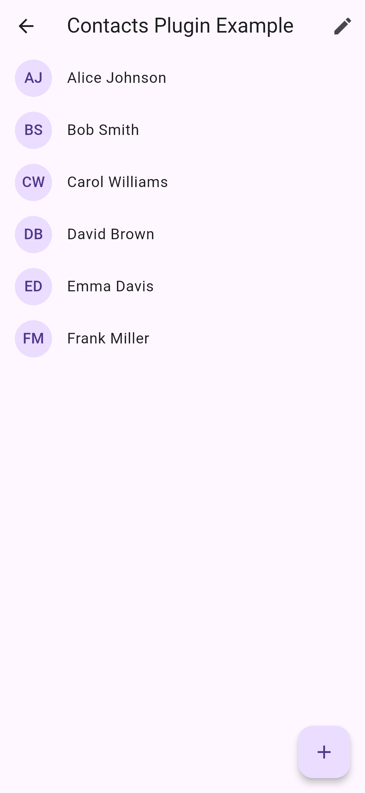
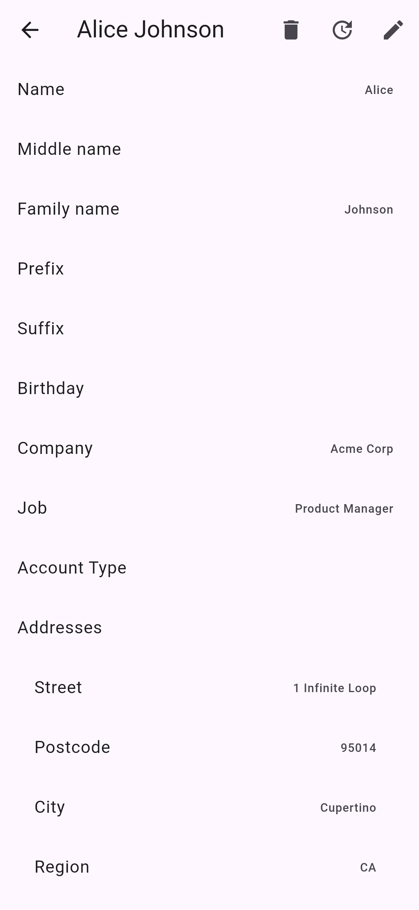
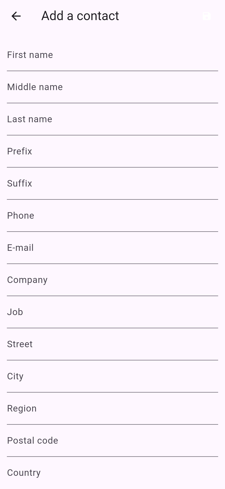
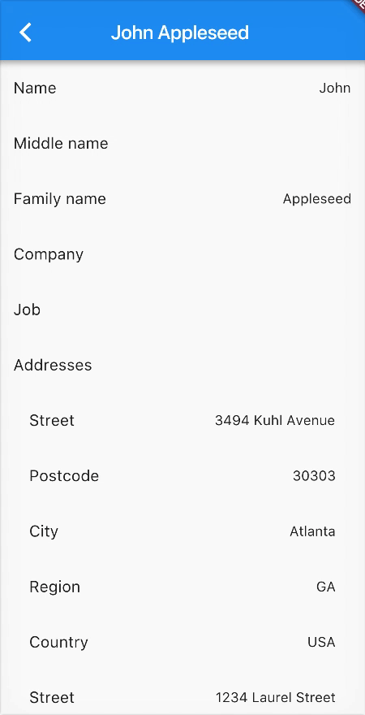

# Contactos

[](https://pub.dev/packages/contactos)
[](https://github.com/ziqq/contactos/actions/workflows/checkout.yml)
[](https://codecov.io/gh/ziqq/contactos)
[](LICENSE)
[](https://pub.dev/packages/flutter_lints)


## Description

A Flutter plugin to read, create, update and delete the device's contacts and
to open the native contact form and picker on Android and iOS.

  



**Usage, permissions and the API reference are in the
[`contactos` README](contactos/README.md).**

```dart
import 'package:contactos/contactos.dart';

final contacts = await Contactos.instance.getContacts(withThumbnails: false);
```


## Packages

The plugin uses the [federated plugin architecture](https://flutter.dev/go/federated-plugins).

| Package | Description | Pub |
|---|---|---|
| [`contactos`](contactos/) | App-facing package | [](https://pub.dev/packages/contactos) |
| [`contactos_platform_interface`](contactos_platform_interface/) | Platform interface and models | [](https://pub.dev/packages/contactos_platform_interface) |
| [`contactos_android`](contactos_android/) | Android implementation (Java, Contacts Provider) | [](https://pub.dev/packages/contactos_android) |
| [`contactos_foundation`](contactos_foundation/) | iOS implementation (Swift, Contacts framework) | [](https://pub.dev/packages/contactos_foundation) |

See [docs/architecture.md](docs/architecture.md) for how the packages fit together.


## Repository structure

```
contactos/
├── contactos/                     # App-facing package
│   ├── example/                   # Example app (also renders the screenshots)
│   └── screenshots/               # README and pub.dev screenshots
├── contactos_platform_interface/  # ContactosPlatform, MethodChannelContactos, models
├── contactos_android/             # Android implementation
│   ├── android/                   # Java plugin and JVM tests
│   └── example/
├── contactos_foundation/          # iOS implementation
│   ├── darwin/                    # Swift plugin (CocoaPods and Swift Package Manager)
│   ├── example/                   # Example app with the RunnerTests XCTest target
│   └── tool/                      # iOS native test and coverage scripts
├── tool/media/                    # Screen recording and media conversion scripts
├── docs/                          # Architecture notes
├── mise.toml                      # Toolchain for mise
├── .fvmrc                         # Toolchain for FVM
└── Makefile                       # Repository-wide make targets
```


## Development

Install the toolchain with [mise](https://mise.jdx.dev) or
[FVM](https://fvm.app), then validate everything:

```sh
mise install   # or: fvm use
make get
make all       # format + analyze + pana + unit tests
```

The Makefiles use `fvm` when it is installed and the SDK from `PATH`
otherwise. See [CONTRIBUTING.md](CONTRIBUTING.md) for the toolchain setup,
native tests, screenshots, screen recordings and the release workflow, and
[.github/AUTOMATION.md](.github/AUTOMATION.md) for CI, publishing, labels and
notifications.


## Changelog

Each package has its own changelog:

- [contactos](contactos/CHANGELOG.md)
- [contactos_platform_interface](contactos_platform_interface/CHANGELOG.md)
- [contactos_android](contactos_android/CHANGELOG.md)
- [contactos_foundation](contactos_foundation/CHANGELOG.md)


## Maintainers

[Anton Ustinoff (ziqq)](https://github.com/ziqq)


## License

[MIT](LICENSE)


## Contributions

Contributions are welcome! If you find a bug or want a feature, please open an
[issue](https://github.com/ziqq/contactos/issues). To contribute code, read
[CONTRIBUTING.md](CONTRIBUTING.md) and open a pull request.


## Funding

If you want to support the development of the library:

- [Buy me a coffee](https://www.buymeacoffee.com/ziqq)
- [Subscribe through Boosty](https://boosty.to/ziqq)


## Coverage


